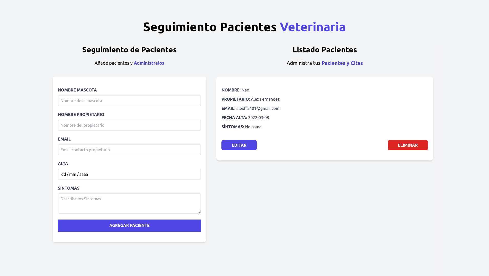

# Gestor de citas Veterinaria

This is a solution to the [QR code component challenge on Frontend Mentor](https://www.frontendmentor.io/challenges/container-component-iux_sIO_H). Frontend Mentor challenges help you improve your coding skills by building realistic projects. 

## Table of contents

- [Gestor de citas Veterinaria](#gestor-de-citas-veterinaria)
  - [Table of contents](#table-of-contents)
  - [Overview](#overview)
    - [Screenshot](#screenshot)
    - [Links](#links)
  - [My process](#my-process)
    - [Built with](#built-with)
  - [Author](#author)

## Overview

### Screenshot

### Links

- Live Site URL: [DEMO](https://awesome-poincare-6a0eae.netlify.app/)

## My process

### Built with

- React 
- Tailwind CSS

## Author

- Website - [Alex Fernandez](https://alexfernandez05.github.io/portfolio/)